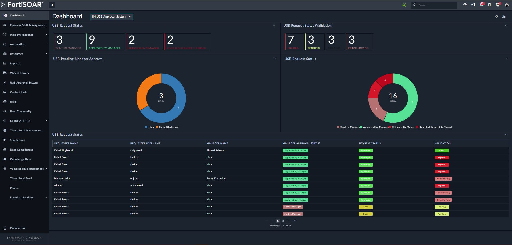
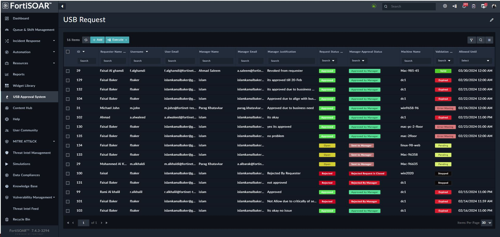
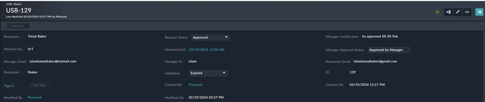
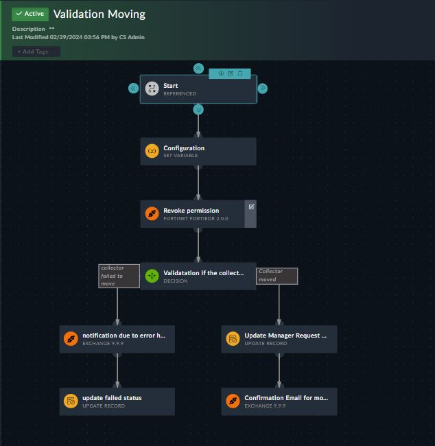
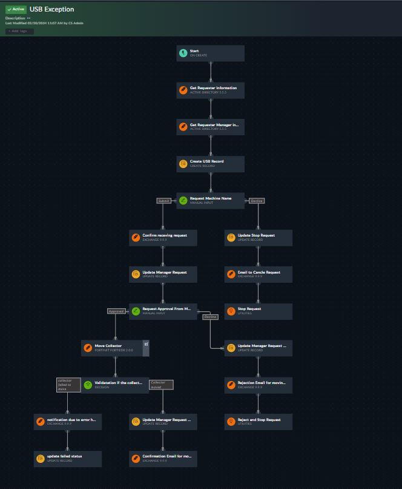
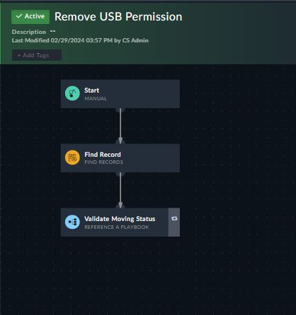

| [Home](../README.md) |
| -------------------- |

# Introduction 

Let's dive into the heart of automation with FortiSOAR! We'll walk through the playbook that streamlines your USB exception process, from the initial request to automatic expiration

## Step 1: Triggered by Email

Imagine this: an employee sends an email to FortiSOAR requesting USB access. Our pre-built playbook automatically detects the email and initiates the process.

## Step 2: Information Gathering

FortiSOAR doesn't waste time with manual data entry. It pulls essential details like the requester's name and manager from your Active Directory, saving you precious time and ensuring accuracy.

## Step 3: Confirmation and Machine Details

A confirmation email zips to the requester, letting them know their request is received. They're then prompted to specify the exact machine requiring access. This ensures clarity and control over what devices are granted exceptions

## Step 4: Manager Approval and Justification

FortiSOAR seamlessly routes the request to the designated manager for approval. The manager can view the request details, access justification, and set an allowance date, all within a user-friendly interface.

## Step 5: Access Granted and Documented

With approval secured, FortiSOAR automatically moves the specified machine to the designated "collector group," granting the requester the requested USB access. Every step is meticulously documented in the "USB Approval System" domain, including names, emails, dates, and justifications, ensuring complete transparency and auditability.

## Step 6: Automatic Expiration and Reversion

No need to worry about forgetting to revoke access! FortiSOAR remembers. When the allowance period ends, it automatically reverts the machine back to its original collector group, effectively disabling USB access and maintaining security.

# Scenario:

* Machine: dc1
* Current Collector Group: flag the hack

Employee sends an email to FortiSOAR requesting USB access for dc1. As soon as FortiSOAR receives the email,The playbook automatically detects the request and initiates the process

FortiSOAR pulls the requester's name and manager information directly from your AD to ensuring accuracy and saving you time. A confirmation email then flies to the requester, acknowledging their request and prompting them fill the exact machine 

With the confirmation received, FortiSOAR updates the request record and changes the status to "Open." And filling the requester name and manager name 

The email will send to manager asking for his decision 

* ## Approval:
If the manager approves, FortiSOAR automatically updates the record with the approval status, adds the manager's comment, and moves dc1 from "flag the hack" to the "allow USB" collector group within FortiEDR, granting the requested access.
* ## Decline:
If the manager declines, the record is updated with the rejection status and the reason, and the requester is notified via email

Last Step FortiSOAR will validate result and update record accordingly if there is any error during moving the status will change to "Error Moving"

## ScreenShots

|                 |            |
|:----------------------------------------|:------------------------------------|
| Dashboard Tab                           | Module Tab                      |

|                |  |
|:----------------------------------------|:-----------------------------------|
| Records                                 | Playbook                           |

|      |  |
|:----------------------------------------|:-----------------------------------|
| Playbook                                | Playbook                           |

# Next Steps

| [Installation](./setup.md#installation) | [Configuration](./setup.md#configuration) | [Contents](./contents.md) |
|-----------------------------------------|-------------------------------------------|---------------------------|
